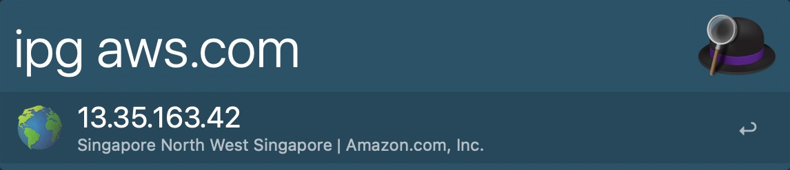

# 🌍 Alfred-ipgeo

Alfred workflow to query an online GeoIP database for a specific IP address or domain.

## 🚀 Features

- ISP info, location, and organization details.
- No external dependencies — uses only Python standard library.

## Requirements

- python3 (stdlib only, no pip packages needed)

## 👋 Usage

Download IPGeo.alfredworkflow from [Release](https://github.com/hunterMG/alfred-ipgeo/releases/) or the latest link below👇 then open it using Alfred to import.

[Latest download.](https://github.com/hunterMG/alfred-ipgeo/releases/latest/download/IPGeo.alfredworkflow)

Simply type your keyword into Alfred (default: `ipg`) and provide a query (IP/Domain) to see its information from an online GeoIP database.

If nothing is typed, your external IPv4 address will be displayed.

## ✅ Todos

- [x] Workflow configuration
- [x] Default python3 package only(remove bs4 dependency for better disturbution)
- [ ] Alfred workflow gallery publish

## Ref

<https://github.com/wrjlewis/notion-search-alfred-workflow>
